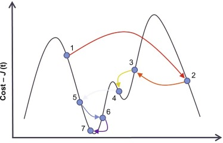
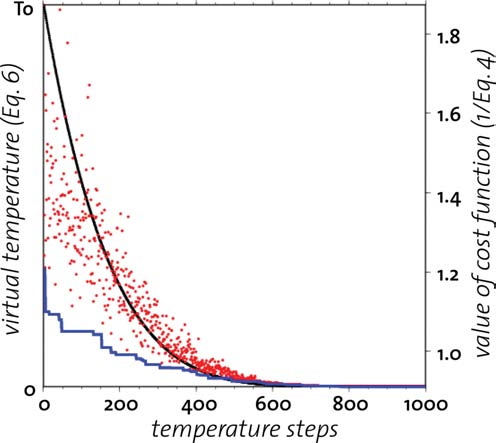
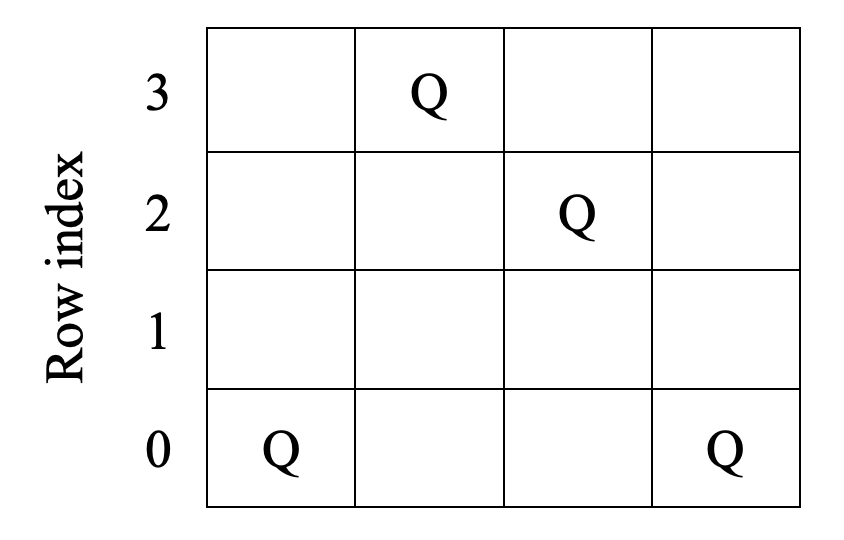

# Simulated-Annealing
A Simulated annealing algorithm is a method to solve bound-constrained and unconstrained optimization parameters models. The method is based on physical annealing and is used to minimize system energy. In every simulated annealing example, a random new point is generated.

<br>

## ⚙️ Technologies


<br>

## 📈 Algorithms:

- <b>Simulated annealing:</b> Simulated Annealing is a stochastic global search optimization algorithm. This means that it makes use of randomness as part of the search process. This makes the algorithm appropriate for nonlinear objective functions where other local search algorithms do not operate well


<br>


<br>

## 👑 N-Queens Problem

The N-queen problem is the task of placing N queens on an NxN grid such that no two queens attack each other. A queen can attack other pieces on the same row, same column, left-to-right diagonal, and right-to-left diagonal. 

This problem can be solved using Simulated annealing. We will use the concise formulation of forcing the N-queens on the N columns of the grid. Thus, a state can be represented by a tuple. For example for 4- queens, s = (0,3,2,0) represents the state (note the usage of 0-indexing) of positioning the first queen in the first column at row 0, the second queen in the second column at row 3, the third queen in the third column at row 2, and the fourth queen in the fourth column at row 0. Note that this state is not a goal state since there are still queens that are attacking each other




<br>

## 🔧 Installation

1. Install newest version of [Python](https://www.python.org/)
2. Install numpy
    ```
    pip install numpy
    ```
3. Install matplotlib
    ```
    pip install matplotlib
    ```
4. Install seaborn
    ```
    pip install seaborn
    ```
5. Run ```test_local_search.py```

## ✒️ Author

 [<br><sub>@M-Alhassan</sub>](https://github.com/M-Alhassan) 
